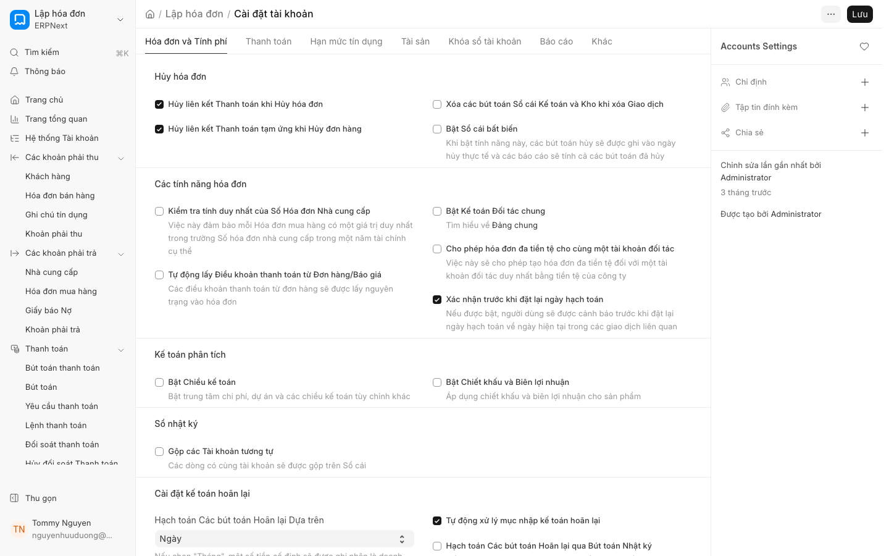

# Tự động đóng sổ kho (Automatic Closing Stock Posting)

**Chủ đề:** Tự động đóng sổ kho trong v16 - Tự động ghi nhận chênh lệch tồn kho vào sổ cái cuối kỳ, thay thế quy trình đóng sổ thủ công.

### 1. Giới thiệu tính năng
> **✨ Mới trong v16**

Trong các phiên bản trước, việc tính toán giá trị tồn kho cuối kỳ thường yêu cầu người dùng phải thực hiện các bước đóng sổ thủ công để cập nhật giá trị tài sản từ kho vào sổ cái. 

Với ERPNext v16, tính năng **Tự động đóng sổ kho (Automatic Closing Stock Posting)** cho phép hệ thống tự động tính toán chênh lệch giữa giá trị tồn kho thực tế và giá trị trên sổ cái, sau đó tự động tạo các bút toán điều chỉnh vào cuối kỳ kế toán. Điều này giúp giảm thiểu sai sót con người, tiết kiệm thời gian và đảm bảo tính chính xác tuyệt đối giữa module Kho và module Kế toán.

### 2. Điều kiện tiên quyết
Để sử dụng tính năng này, hệ thống của bạn cần đáp ứng các điều kiện sau:
* Đã thiết lập phương pháp định giá tồn kho (FIFO hoặc Moving Average).
* Đã cấu hình các tài khoản kế toán liên quan trong [Bảng tài khoản kế toán](../../accounts/account-settings.md).
* Đã thiết lập các [Kho](../../stock/warehouse-settings.md) và [Mặt hàng](../../stock/item-settings.md) đầy đủ.

### 3. Hướng dẫn từng bước

Để kích hoạt tính năng tự động đóng sổ kho, hãy thực hiện theo các bước sau:

1. Truy cập vào module **Kế toán (Accounts)**.
2. Tìm kiếm và chọn **Thiết lập kế toán (Account Settings)**.
3. Cuộn xuống phần **Quản lý tồn kho (Stock Management)**.
4. Tích chọn vào ô **Tự động đóng sổ kho (Automatic Closing Stock Posting)**.
5. Chọn **Kỳ kế toán (Accounting Period)** mà bạn muốn hệ thống thực hiện chênh lệch tự động.
6. Nhấn **Lưu (Save)** để hoàn tất thiết lập.

### 4. Ảnh minh họa
*(Vui lòng xem hình ảnh cấu hình trong phần Thiết lập kế toán dưới đây)*

### 5. Các tùy chọn/cài đặt liên quan

* **Kỳ kế toán mặc định (Default Accounting Period):** Hệ thống sẽ dựa vào kỳ kế toán đang mở để thực hiện lệnh đóng sổ tự động.
* **Tài khoản chênh lệch tồn kho (Stock Adjustment Account):** Tài khoản dùng để ghi nhận các bút toán điều chỉnh chênh lệch giữa giá trị tồn kho và sổ cái.
* **Tự động tạo Bút toán (Auto-generate Journal Entry):** Khi tính năng được kích hoạt, hệ thống sẽ tự động tạo [Bút toán (JE)](../../accounts/journal-entry.md) điều chỉnh ngay khi kỳ kế toán được đóng.

### 6. Lưu ý quan trọng

* **Kiểm tra dữ liệu trước khi đóng kỳ:** Mặc dù hệ thống tự động, bạn vẫn nên kiểm tra lại các [Phiếu kho (SE)](../../stock/stock-entry.md) hoặc [Phiếu nhập hàng (PR)](../../stock/purchase-receipt.md) chưa được xác nhận để tránh sai lệch dữ liệu.
* **Ảnh hưởng đến Báo cáo tài chính:** Việc tự động đóng sổ sẽ tạo ra các bút toán điều chỉnh giá trị hàng tồn kho, ảnh hưởng trực tiếp đến Giá vốn hàng bán (COGS) trên Bảng cân đối kế toán.
* **Không thể hoàn tác dễ dàng:** Một khi kỳ kế toán đã được đóng và bút toán tự động đã được [Xác nhận (Submit)], việc điều chỉnh lại đòi hỏi phải thực hiện các bút toán điều chỉnh thủ công.

### 7. Liên kết đến trang liên quan

* [Thiết lập Kế toán](../../accounts/account-settings.md)
* [Quản lý Kho và Tồn kho](../../stock/stock-management.md)
* [Quản lý Mặt hàng](../../stock/item-settings.md)
* [Hướng dẫn về Bút toán (JE)](../../accounts/journal-entry.md)