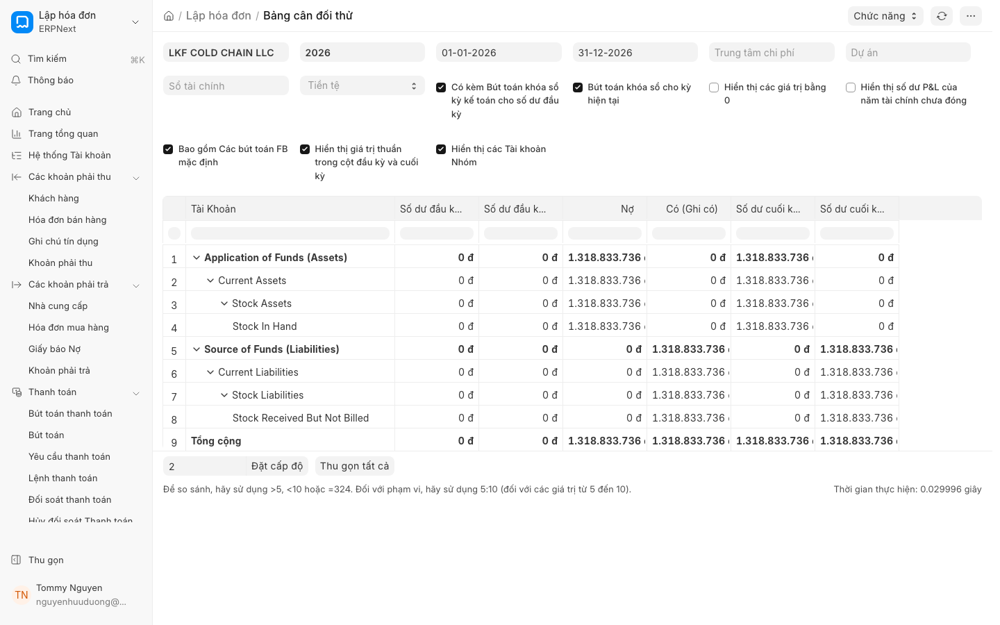

# Mẫu báo cáo tài chính (Financial Report Template)

## 1. Giới thiệu tính năng
**[Mới trong v16]** Tính năng **Mẫu báo cáo tài chính (Financial Report Template)** cho phép người dùng xây dựng các báo cáo tài chính tùy chỉnh như Báo cáo Kết quả hoạt động kinh doanh (P&L) và Bảng cân đối kế toán (Balance Sheet) theo cấu trúc riêng của doanh nghiệp. 

Thay vì sử dụng các báo cáo mặc định, bạn có thể:
*   Tự định nghĩa cấu trúc dòng và cột.
*   Sử dụng các công thức toán học phức tạp để tính toán các chỉ số tài chính.
*   Đáp ứng các tiêu chuẩn kế toán quốc tế như **IFRS**.
*   Hỗ trợ báo cáo hợp nhất cho mô hình **Multi-company** (đa công ty).

## 2. Điều kiện tiên quyết
Để sử dụng tính năng này, người dùng cần đảm bảo:
*   Có quyền **Account Manager** hoặc quyền truy cập vào các module Tài chính.
*   Đã thiết lập đầy đủ Hệ thống tài khoản (Chart of Accounts).
*   Đã thực hiện **Xác nhận (Submit)** các bút toán (JE) liên quan để dữ liệu được cập nhật chính xác.

## 3. Hướng dẫn từng bước

### Bước 1: Tạo Mẫu báo cáo mới
1. Truy cập vào thanh tìm kiếm, nhập "Financial Report Template" và chọn tài liệu này.
2. Nhấn **Thêm Mẫu báo cáo mới (New Financial Report Template)**.
3. Nhập **Tên mẫu báo cáo** (Ví dụ: *Báo cáo P&L theo IFRS*).
4. Chọn **Loại báo cáo** (Bảng cân đối kế toán hoặc Báo cáo kết quả kinh doanh).

### Bước 2: Thiết lập cấu trúc dòng (Rows) và cột (Columns)
1. Tại bảng **Rows (Dòng)**, bạn thêm các dòng đại diện cho các nhóm tài khoản hoặc các chỉ số cần tính toán.
2. Sử dụng cột **Account Type** hoặc **Account Head** để liên kết dòng với các tài khoản cụ thể trong Hệ thống tài khoản.
3. Để tạo các dòng tổng hợp (ví dụ: Tổng doanh thu), hãy sử dụng tính năng **Parent Row** để nhóm các dòng con lại.

### Bước 3: Sử dụng công thức (Formulas)
Đây là phần quan trọng nhất để tạo ra các chỉ số tự động:
1. Tại dòng bạn muốn tính toán, tìm đến cột **Formula**.
2. Nhập công thức dựa trên tên của các dòng (Row ID) hoặc các hàm toán học.
    *   *Ví dụ:* Để tính Lợi nhuận gộp, bạn có thể nhập: `[Doanh thu] - [Giá vốn hàng bán]`.
    *   *Ví dụ:* Để tính Tỷ suất lợi nhuận: `([Lợi nhuận thuần] / [Doanh thu]) * 100`.
3. Hệ thống sẽ tự động tính toán giá trị dựa trên dữ liệu thực tế từ các tài khoản đã được thiết lập.

### Bước 4: Lưu và Sử dụng
1. Nhấn **Lưu (Save)** để hoàn tất thiết lập.
2. Để xem báo cáo, truy cập vào module Tài chính, chọn báo cáo tương ứng và chọn **Mẫu báo cáo** bạn vừa tạo từ bộ lọc.

## 4. Các tùy chọn/cài đặt liên quan
*   **Multi-company:** Cho phép chọn một hoặc nhiều công ty để hợp nhất dữ liệu lên báo cáo.
*   **Periodicity:** Thiết lập chế độ xem theo Ngày, Tháng, Quý hoặc Năm.
*   **Filter:** Cho phép thêm các bộ lọc như Kho (Warehouse), Chi nhánh hoặc Trung tâm chi phí (Cost Center).

## 5. Lưu ý quan trọng
*   **Tính chính xác của công thức:** Đảm bảo các ID dòng trong công thức khớp chính xác với ID bạn đã đặt ở cột "Row ID".
*   **Dữ liệu thời gian thực:** Báo cáo chỉ phản ánh dữ liệu sau khi các **Bút toán (JE)** đã được **Xác nhận (Submit)**. Các bút toán đang ở trạng thái nháp sẽ không được tính vào báo cáo.
*   **Sao lưu cấu trúc:** Trước khi thay đổi các công thức phức tạp trên mẫu báo cáo đang dùng, hãy sao chép mẫu đó ra một bản nháp để tránh làm gián đoạn báo cáo định kỳ.

## 6. Liên kết đến trang liên quan
* [Hệ thống tài khoản (Chart of Accounts)](chart-of-accounts.md)
* [Quản lý Bút toán (Journal Entry)](journal-entry.md)
* [Báo cáo kết quả kinh doanh mặc định](profit-loss-statement.md)