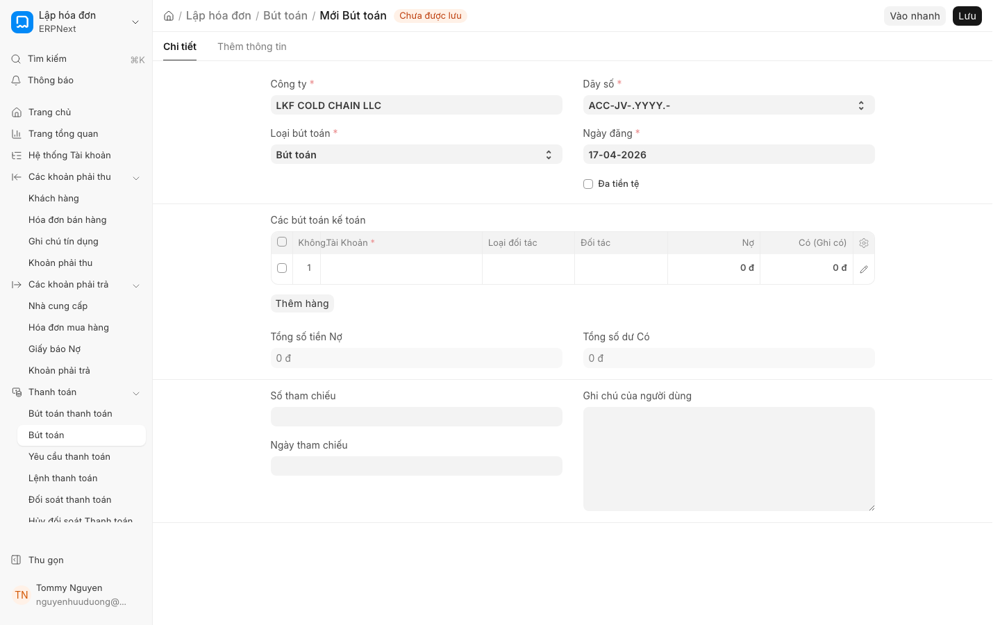

# Kế toán theo kỳ (Periodic Accounting)

**Mới trong v16**

Tính năng Kế toán theo kỳ (Periodic Accounting) trong ERPNext v16 cho phép doanh nghiệp ghi nhận các biến động Tồn kho (Stock In/Out) theo định kỳ thông qua Bút toán (Journal Entry) thay vì sử dụng phương pháp kê khai thường xuyên (Perpetual Inventory) tự động. Đây là giải pháp tối ưu cho các doanh nghiệp nhỏ hoặc các đơn vị có quy mô quản lý kho đơn giản, giúp giảm tải khối lượng bút toán tự động phát sinh hàng ngày trong hệ thống.

## 1. Giới thiệu tính năng
Thay vì hệ thống tự động tạo Bút toán (JE) ngay khi có Phiếu nhập hàng (PR) hoặc Phiếu giao hàng (DN), phương pháp Kế toán theo kỳ cho phép bạn tổng hợp giá trị hàng nhập/xuất trong một khoảng thời gian (tuần/tháng) và thực hiện một Bút toán tổng hợp duy nhất để cập nhật giá trị tồn kho và giá vốn hàng bán.

## 2. Điều kiện tiên quyết
Để sử dụng tính năng này, bạn cần đảm bảo các điều kiện sau:
* Đã thiết lập danh mục Mặt hàng (Item) và Kho (Warehouse).
* Đã thiết lập hệ thống Tài khoản kế toán (Chart of Accounts) đầy đủ.
* Đã cấu hình phương pháp tính giá trị tồn kho trong cài đặt Kho.

## 3. Hướng dẫn từng bước

Để thực hiện ghi nhận kế toán theo kỳ, hãy làm theo các bước sau:

1. **Tổng hợp dữ liệu kho:** Truy cập vào báo cáo **Kho hàng (Stock Balance)** hoặc **Báo cáo giá trị tồn kho** để xác định tổng giá trị nhập và xuất của các Mặt hàng trong kỳ.
2. **Tạo Bút toán (Journal Entry):**
    * Truy cập vào module **Kế toán** > **Bút toán (Journal Entry)**.
    * Nhấn **Thêm mới (New)**.
3. **Nhập thông tin bút toán:**
    * Chọn loại Bút toán phù hợp (thường là loại *Journal Entry*).
    * Tại bảng dòng bút toán, nhập tài khoản Kho hàng (Inventory Account) và tài khoản Giá vốn hàng bán (Cost of Goods Sold).
    * Nhập số tiền dựa trên dữ liệu đã tổng hợp từ bước 1.
4. **Kiểm tra và Xác nhận:**
    * Kiểm tra tính cân bằng giữa Nợ (Debit) và Có (Credit).
    * Nhấn **Lưu (Save)** để lưu bản nháp.
    * Nhấn **Xác nhận (Submit)** để hoàn tất ghi nhận vào sổ cái.

## 4. Các tùy chọn và cài đặt liên quan
* **Cấu hình Kho (Stock Settings):** Kiểm tra tùy chọn liên quan đến việc tự động tạo bút toán kế toán khi thực hiện giao dịch kho. Nếu sử dụng Kế toán theo kỳ, tùy chọn này cần được điều chỉnh để tránh trùng lặp dữ liệu.
* **Báo cáo Giá trị tồn kho:** Sử dụng để đối chiếu số liệu trước khi tạo Bút toán.

## 5. Lưu ý quan trọng
* **Tránh trùng lặp:** Nếu bạn đã sử dụng Kế toán theo kỳ, hãy đảm bảo rằng các giao dịch kho (PR, DN, SE) không được thiết lập để tự động đẩy bút toán kế toán, nhằm tránh việc ghi nhận giá trị hàng tồn kho hai lần.
* **Đối chiếu định kỳ:** Do không ghi nhận tức thời, việc đối chiếu giữa số dư Kho và số dư Tài khoản kế toán cần được thực hiện nghiêm ngặt vào cuối mỗi kỳ.
* **Độ chính xác:** Việc nhập liệu Bút toán thủ công phụ thuộc hoàn toàn vào tính chính xác của các chứng từ kho đã thực hiện.

## 6. Liên kết liên quan
* [Quản lý Kho hàng](../stock/overview.md)
* [Quản lý Bút toán](../accounts/journal-entry.md)
* [Danh mục Mặt hàng](../stock/item.md)