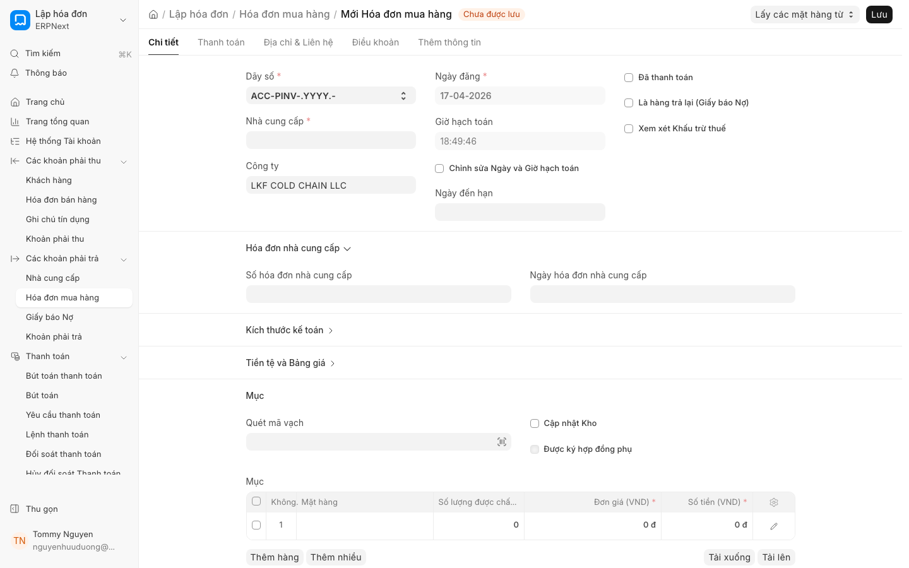

# Ghi nhận chi phí mua hàng (Purchase Expense Booking)

**Chủ đề:** Purchase Expense Booking trong v16 - ghi nhận COGS và chi phí dịch vụ riêng biệt. Tách COGS khỏi service expenses cho P&L sạch hơn.

## 1. Giới thiệu tính năng (Mới trong v16)

Trong phiên bản ERPNext v16, quy trình ghi nhận chi phí mua hàng đã được cải tiến để cung cấp khả năng kiểm soát tài chính chính xác hơn. Tính năng này cho phép người dùng tách biệt rõ ràng giữa **Giá vốn hàng bán (COGS)** và **Chi phí dịch vụ (Service Expenses)** ngay tại thời điểm lập Hóa đơn mua hàng.

Việc tách biệt này giúp báo cáo Kết quả hoạt động kinh doanh (P&L) trở nên minh bạch, giúp nhà quản lý phân biệt được chi phí trực tiếp cấu thành nên giá trị hàng hóa và các chi phí vận hành/dịch vụ phát sinh thêm, từ đó tối ưu hóa việc phân tích biên lợi nhuận gộp.

## 2. Điều kiện tiên quyết

Để thực hiện ghi nhận chi phí mua hàng một cách chính xác, bạn cần đảm bảo các điều kiện sau:
* Đã thiết lập đầy đủ danh mục **Mặt hàng (Item)** và **Nhà cung cấp (Supplier)**.
* Các tài khoản kế toán (Account) cho Kho, Giá vốn hàng bán và Chi phí dịch vụ đã được cấu hình trong hệ thống.
* Đã có **Đơn mua hàng (PO)** hoặc các chứng từ mua hàng liên quan đã được **Xác nhận (Submit)**.

## 3. Hướng dẫn từng bước

Để ghi nhận chi phí mua hàng và tách biệt COGS với chi phí dịch vụ, hãy thực hiện theo các bước sau:

1. **Truy cập Hóa đơn:** Mở **Hóa đơn (Invoice)** mua hàng từ **Đơn mua hàng (PO)** đã được xác nhận hoặc tạo mới trực tiếp.
2. **Chọn Nhà cung cấp:** Chọn **Nhà cung cấp (Supplier)** tương ứng. Hệ thống sẽ tự động lấy các thông tin thuế và điều khoản thanh toán.
3. **Ghi nhận hàng hóa (COGS):**
    * Tại bảng **Mặt hàng (Item)**, thêm các dòng hàng hóa bạn đã mua.
    * Đảm bảo các mặt hàng này được liên kết với tài khoản kho và tài khoản giá vốn tương ứng.
4. **Ghi nhận chi phí dịch vụ (Service Expenses):**
    * Thay vì cộng gộp chi phí vận chuyển hoặc phí dịch vụ vào giá của mặt hàng, hãy thêm một dòng mới tại bảng **Mặt hàng (Item)**.
    * Chọn loại mặt hàng là "Service" (Dịch vụ) hoặc sử dụng tài khoản chi phí trực tiếp.
    * Nhập số tiền chi phí dịch vụ vào cột giá trị.
5. **Kiểm tra thuế và tổng tiền:** Kiểm tra lại các dòng thuế và tổng số tiền phải trả cho **Nhà cung cấp (Supplier)**.
6. **Lưu và Xác nhận:** Nhấn **Lưu (Save)** để kiểm tra dữ liệu, sau đó nhấn **Xác nhận (Submit)** để ghi nhận bút toán kế toán.

## 4. Ảnh minh họa

*(Vui lòng xem hình ảnh minh họa cách phân bổ dòng hàng hóa và dòng chi phí dịch vụ tại đây)*

## 5. Các tùy chọn/cài đặt liên quan

* **Account Mapping:** Cấu hình tài khoản chi phí trong danh mục Mặt hàng để đảm bảo khi **Xác nhận (Submit)**, hệ thống đẩy đúng vào tài khoản P&L mong muốn.
* **Purchase Taxes and Charges Template:** Sử dụng các mẫu thuế để tự động hóa việc tính toán thuế GTGT hoặc các loại phí phụ thu.
* **Landed Cost Voucher:** Nếu bạn muốn phân bổ chi phí dịch vụ (như vận chuyển) trực tiếp vào giá trị tồn kho của **Mặt hàng (Item)** thay vì ghi nhận vào chi phí trong kỳ, hãy sử dụng tính năng *Landed Cost Voucher*.

## 6. Lưu ý quan trọng

* **⚠️ Tách biệt dòng dữ liệu:** Để P&L sạch, tuyệt đối không cộng gộp phí dịch vụ vào đơn giá của mặt hàng nếu bạn muốn theo dõi chi phí dịch vụ riêng biệt.
* **⚠️ Kiểm tra tồn kho:** Khi **Xác nhận (Submit)** hóa đơn có mặt hàng, hệ thống sẽ tự động cập nhật số lượng vào **Kho (Warehouse)**. Hãy đảm bảo số lượng khớp với thực tế.
* **⚠️ Kiểm tra bút toán:** Sau khi **Xác nhận (Submit)**, hãy kiểm tra **Bút toán (JE)** để đảm bảo các tài khoản Nợ/Có đã được hạch toán đúng theo phân loại COGS và Chi phí dịch vụ.

## 7. Liên kết đến trang liên quan

* [Quản lý Đơn mua hàng (PO)](purchase_order.md)
* [Quản lý Hóa đơn mua hàng (Purchase Invoice)](purchase_invoice.md)
* [Quản lý Kho và Tồn kho (Stock)](stock_management.md)
* [Báo cáo Kết quả hoạt động kinh doanh (P&L)](profit_loss.md)