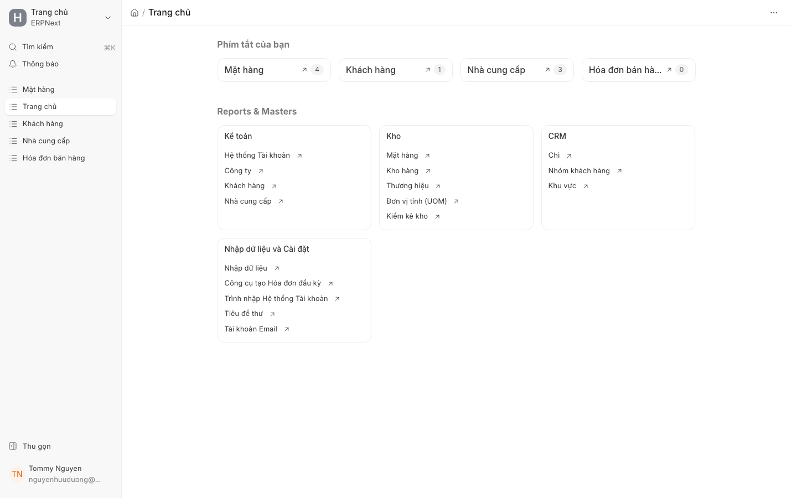

# Định mức NVL ảo (Phantom BOM)

## 1. Giới thiệu tính năng
> **✨ Mới trong v16**

**Định mức NVL ảo (Phantom BOM)** là một tính năng nâng cao trong ERPNext v16, cho phép quản lý các cụm lắp ráp phụ (sub-assembly) mà không cần phải tạo Lệnh sản xuất (Work Order) riêng biệt cho từng cấp trung gian. 

Thay vì phải quản lý tồn kho và quy trình sản xuất cho các bộ phận phụ, hệ thống sẽ tự động "giải nén" (expand) danh sách vật tư từ Phantom BOM vào Lệnh sản xuất của sản phẩm cuối cùng. Điều này giúp đơn giản hóa quy trình quản lý, giảm bớt các bước thao tác thủ công và phản ánh chính xác cấu trúc vật tư thực tế tại xưởng.

## 2. Điều kiện tiên quyết
Để sử dụng tính năng Phantom BOM, bạn cần đảm bảo các điều kiện sau:
* Đã kích hoạt tính năng **Sản xuất (Manufacturing)** trong Module.
* Các **Mặt hàng (Item)** thành phần đã được thiết lập đúng danh mục.
* Có sẵn **Định mức nguyên vật liệu (BOM)** cho sản phẩm chính.

## 3. Hướng dẫn từng bước

Để thiết lập một Phantom BOM, hãy thực hiện theo các bước sau:

1. **Tạo BOM cho cụm lắp ráp phụ:**
   - Truy cập vào danh mục **Mặt hàng (Item)** và chọn mặt hàng đóng vai trò là cụm lắp ráp.
   - Tạo một bản ghi **Định mức nguyên vật liệu (BOM)** mới cho mặt hàng này.
   - Tại bảng **Thành phần (Items)**, liệt kê tất cả các linh kiện/nguyên liệu cấu thành cụm lắp ráp đó.

2. **Kích hoạt chế độ Phantom:**
   - Trong giao diện chỉnh sửa BOM của cụm lắp ráp phụ, tìm tùy chọn **Is Phantom (Là Phantom)**.
   - Tích chọn vào ô này.
   - Nhấn **Lưu (Save)**.

3. **Thiết lập BOM cho sản phẩm cuối cùng:**
   - Tạo BOM cho sản phẩm hoàn thiện.
   - Thêm cụm lắp ráp phụ (đã thiết lập là Phantom ở bước trên) vào danh sách **Thành phần (Items)**.
   - Nhấn **Lưu (Save)**.

4. **Kiểm tra kết quả khi tạo Lệnh sản xuất:**
   - Tạo một **Lệnh sản xuất (Work Order)** cho sản phẩm cuối cùng.
   - Nhấn **Xác nhận (Submit)**.
   - Khi hệ thống tự động tạo **Phiếu yêu cầu vật tư (MR)** hoặc danh sách vật tư cho Lệnh sản xuất, bạn sẽ thấy các linh kiện của cụm phụ đã được liệt kê trực tiếp thay vì chỉ hiển thị tên cụm lắp ráp.

## 4. Ảnh minh họa
*(Hình ảnh minh họa giao diện thiết lập tùy chọn "Is Phantom" trong BOM)*

## 5. Các tùy chọn/cài đặt liên quan
* **Is Phantom (Là Phantom):** Tùy chọn quan trọng nhất để xác định BOM này sẽ được tự động giải nén.
* **BOM Item (Mặt hàng trong BOM):** Các thành phần cấp dưới sẽ được đẩy thẳng vào danh sách vật tư của cấp trên.
* **Work Order Expansion:** Cơ chế tự động tính toán định mức khi tạo lệnh sản xuất.

## 6. Lưu ý quan trọng
* **Tồn kho (Stock):** Vì là Phantom BOM, hệ thống sẽ **không** tạo các bút toán nhập kho cho cụm lắp ráp phụ. Sản phẩm phụ này không tồn tại dưới dạng thực thể độc lập trong **Kho (Warehouse)**.
* **Quản lý Lô hàng (Batch):** Nếu các thành phần bên trong Phantom BOM có quản lý theo **Lô hàng (Batch)**, hệ thống vẫn đảm bảo truy xuất nguồn gốc chính xác khi giải nén.
* **Chi phí:** Chi phí của các linh kiện thành phần sẽ được cộng dồn trực tiếp vào giá thành của sản phẩm cuối cùng.

## 7. Liên kết đến trang liên quan
* [Định mức nguyên vật liệu (BOM)](bom.md)
* [Lệnh sản xuất (Work Order)](work_order.md)
* [Quản lý Kho và Vật tư](stock_management.md)
* [Quản lý Mặt hàng (Item)](item.md)