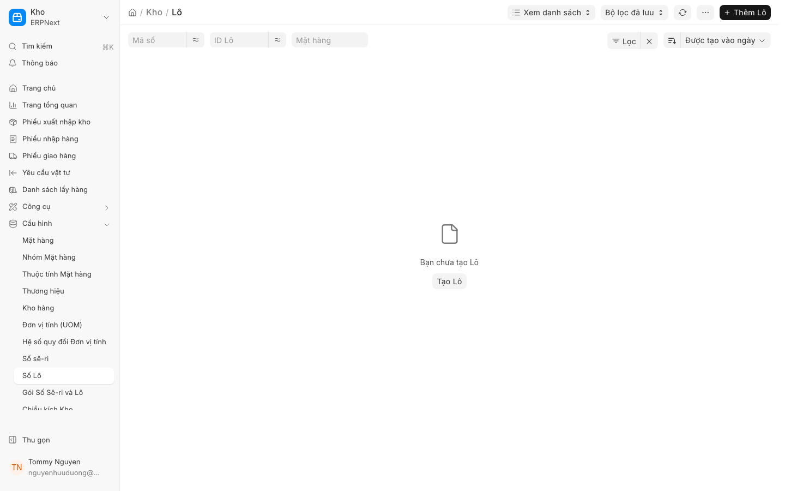

# Truy xuất nguồn gốc lô hàng (Serial & Batch Traceability)

### 1. Giới thiệu tính năng [Mới trong v16]

Trong phiên bản ERPNext v16, tính năng **Truy xuất nguồn gốc (Traceability)** đã được nâng cấp mạnh mẽ để đáp ứng các tiêu chuẩn khắt khe về an toàn thực phẩm và quản lý chuỗi cung ứng lạnh (cold-chain). Tính năng này cho phép doanh nghiệp theo dõi toàn bộ vòng đời của một sản phẩm dựa trên **Lô hàng (Batch)** hoặc **Số Serial**.

Khả năng truy xuất được chia làm hai chiều:
*   **Truy xuất xuôi (Forward Tracing):** Theo dõi từ Nguyên vật liệu (NVL) $\rightarrow$ Quá trình sản xuất $\rightarrow$ Thành phẩm $\rightarrow$ Khách hàng. Giúp kiểm soát nhanh các lô hàng bị lỗi cần thu hồi.
*   **Truy xuất ngược (Backward Tracing):** Theo dõi từ Thành phẩm $\rightarrow$ Các lô NVL đầu vào $\rightarrow$ Nhà cung cấp. Giúp xác định nguyên nhân gốc rễ khi có sự cố chất lượng.

### 2. Điều kiện tiên quyết

Để sử dụng tính năng này, hệ thống cần được thiết lập các điều kiện sau:
*   **Mặt hàng (Item)** phải được kích hoạt tùy chọn `Has Batch No` hoặc `Has Serial No`.
*   Đã thực hiện các giao dịch nhập kho (**PR/Phiếu nhập hàng**) hoặc sản xuất có gắn số Lô/Serial.
*   Đã thiết lập danh mục **Kho (Warehouse)** để quản lý tồn kho theo lô.

### 3. Hướng dẫn từng bước

#### A. Truy xuất nguồn gốc từ một Lô hàng/Serial cụ thể
1.  Truy cập vào danh mục **Mặt hàng (Item)** hoặc **Tồn kho (Stock)**.
2.  Tìm kiếm và chọn **Lô hàng (Batch)** hoặc **Số Serial** cần kiểm tra.
3.  Tại giao diện chi tiết, tìm đến mục **Traceability Report** (Báo cáo truy xuất).
4.  Hệ thống sẽ hiển thị sơ đồ cây (Tree view) các giao dịch liên quan.

#### B. Truy xuất ngược (Từ Thành phẩm về Nhà cung cấp)
1.  Mở **Hóa đơn (Invoice)** hoặc **Đơn bán hàng (SO)** của khách hàng để xác định số Lô/Serial của thành phẩm.
2.  Nhấp vào số **Lô hàng (Batch)** trong chi tiết dòng hàng.
3.  Sử dụng chức năng **Traceability** để xem các lệnh sản xuất (Work Order) đã tiêu thụ những lô NVL nào.
4.  Từ lô NVL, kiểm tra **Phiếu nhập hàng (PR)** để tìm thông tin **Nhà cung cấp (Supplier)**.

#### C. Truy xuất xuôi (Từ NVL đến Khách hàng)
1.  Xác định số **Lô hàng (Batch)** của nguyên liệu đầu vào từ **Phiếu nhập hàng (PR)**.
2.  Kiểm tra các lệnh sản xuất đã sử dụng lô NVL này để biết chúng đã chuyển thành những **Mặt hàng (Item)** thành phẩm nào.
3.  Từ thành phẩm, kiểm tra các **Đơn bán hàng (SO)** hoặc **Phiếu giao hàng (DN)** để xác định danh sách **Khách hàng (Customer)** đã nhận lô hàng lỗi.

### 4. Ảnh minh họa

*Hình 1: Giao diện quản lý Lô hàng (Batch) trong ERPNext v16.*

### 5. Các tùy chọn/cài đặt liên quan

*   **Batch Expiry Date:** Thiết lập ngày hết hạn cho lô hàng (quan trọng cho ngành thực phẩm).
*   **Last Batch:** Tự động gợi ý lô hàng cũ nhất để xuất kho trước (FIFO).
*   **Quality Inspection (QI):** Kết nối kết quả **Kiểm tra chất lượng** trực tiếp với số Lô/Serial để chặn các lô hàng không đạt chuẩn trước khi xuất kho.

### 6. Lưu ý quan trọng

*   **Tính chính xác của dữ liệu:** Tính năng truy xuất chỉ có hiệu lực nếu nhân viên kho thực hiện ghi nhận số Lô/Serial chính xác tại thời điểm **Xác nhận (Submit)** các chứng từ nhập/xuất.
*   **Cold-chain:** Đối với hàng thực phẩm, cần kết hợp theo dõi nhiệt độ trong **Phiếu kho (SE)** để đảm bảo tính toàn vẹn của lô hàng trong suốt quá trình vận chuyển.
*   **Kiểm soát nghiêm ngặt:** Luôn thực hiện **Kiểm tra chất lượng (QI)** ngay khi nhận **Phiếu nhập hàng (PR)** để gắn nhãn trạng thái cho Lô hàng.

### 7. Liên kết đến trang liên quan

*   [Quản lý Kho hàng (Stock Management)](../stock/management.md)
*   [Quản lý Lô hàng & Serial (Batch & Serial Management)](../stock/batch-serial.md)
*   [Quy trình Kiểm tra chất lượng (Quality Inspection)](../quality/inspection.md)
*   [Quản lý Mua hàng (Purchasing)](../buying/overview.md)