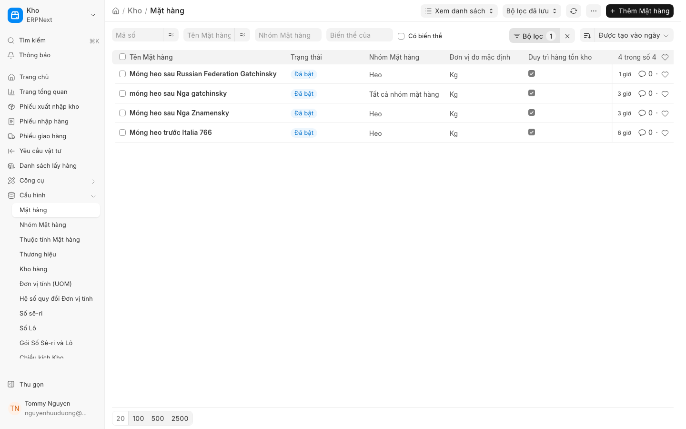

# Giữ tồn kho (Stock Reservation)

**Mới trong v16**

Tính năng **Giữ tồn kho (Stock Reservation)** trong ERPNext v16 cho phép bạn dành riêng một lượng **Mặt hàng** nhất định trong **Kho** cho các tài liệu cụ thể (như **Đơn bán hàng** hoặc **Lệnh sản xuất**). Điều này giúp ngăn chặn việc các đơn hàng khác lấy mất hàng hóa đã được dự kiến, đảm bảo tính chính xác trong việc lập kế hoạch cung ứng và tránh tình trạng thiếu hụt hàng khi cần giao cho khách.

## 1. Giới thiệu tính năng

Trước phiên bản v16, việc quản lý tồn kho dựa trên số lượng thực tế có thể dẫn đến việc hàng hóa bị phân bổ sai cho các đơn hàng được tạo sau nhưng có ưu tiên cao hơn. Với tính năng **Giữ tồn kho**, hệ thống sẽ tạo một lệnh "giữ chỗ" ảo. Số lượng này vẫn nằm trong kho nhưng sẽ được đánh dấu là "Đã giữ" (Reserved), không được phép phân bổ cho các yêu cầu khác trừ khi lệnh giữ được giải phóng.

## 2. Điều kiện tiên quyết

Để sử dụng tính năng này, bạn cần đảm bảo các thiết lập sau:
* Đã kích hoạt tính năng Quản lý kho trong module **Tồn kho**.
* Đã thiết lập danh mục **Mặt hàng** và số lượng tồn kho trong **Kho**.
* (Tùy chọn) Đã kích hoạt tính năng *Allow Stock Reservation* trong *Stock Settings*.

## 3. Hướng dẫn từng bước

### 3.1. Cách bật tính năng Giữ tồn kho
1. Truy cập vào module **Kho**.
2. Tìm kiếm và chọn **Thiết lập kho (Stock Settings)**.
3. Tìm tùy chọn **Cho phép giữ tồn kho (Allow Stock Reservation)** và tích chọn.
4. Nhấn **Lưu**.

### 3.2. Giữ hàng từ Đơn bán hàng (SO)
Khi bạn muốn đảm bảo hàng hóa luôn có sẵn cho một khách hàng cụ thể:
1. Mở **Đơn bán hàng (SO)** mà bạn muốn giữ hàng.
2. Trong danh sách các dòng **Mặt hàng**, tìm cột **Giữ tồn kho (Reserved Qty)** (nếu không thấy, hãy vào *Menu > Customize* để hiển thị cột này).
3. Nhập số lượng bạn muốn giữ cho mỗi **Mặt hàng**.
4. Nhấn **Lưu**. 
5. Hệ thống sẽ ghi nhận số lượng này là hàng đã được giữ cho đơn hàng này.

### 3.3. Giữ hàng cho Lệnh sản xuất (Work Order)
Để đảm bảo nguyên vật liệu có sẵn cho quá trình sản xuất:
1. Mở **Lệnh sản xuất (Work Order)** tương ứng.
2. Tại phần danh sách nguyên vật liệu, chọn số lượng cần thiết.
3. Hệ thống sẽ tự động thực hiện lệnh giữ hàng khi bạn **Xác nhận (Submit)** Lệnh sản xuất, dựa trên cấu hình định mức nguyên vật liệu (BOM).

### 3.4. Giải phóng hàng (Release Reservation)
Nếu đơn hàng bị hủy hoặc không cần giữ hàng nữa:
1. Mở tài liệu đang giữ hàng (**Đơn bán hàng** hoặc **Lệnh sản xuất**).
2. Nếu tài liệu chưa **Xác nhận (Submit)**, bạn chỉ cần xóa số lượng ở cột **Giữ tồn kho** và **Lưu**.
3. Nếu tài liệu đã **Xác nhận (Submit)**, bạn phải **Hủy (Cancel)** tài liệu hoặc sử dụng chức năng **Giải phóng giữ hàng (Release Reservation)** (nếu được cấu hình) để đưa số lượng hàng trở lại trạng thái sẵn sàng phân bổ.

## 4. Ảnh minh họa

*Hình 1: Giao diện quản lý Mặt hàng và theo dõi số lượng tồn kho/giữ hàng.*

## 5. Các tùy chọn/cài đặt liên quan

* **Ưu tiên giữ hàng (Reservation Priority):** Cho phép thiết lập mức độ ưu tiên giữa các đơn hàng khác nhau.
* **Tự động giữ hàng (Auto-reserve):** Tùy chọn tự động giữ hàng ngay khi **Đơn bán hàng** được **Xác nhận (Submit)**.
* **Kiểm tra tồn kho khi giữ hàng:** Ngăn chặn việc nhập số lượng giữ vượt quá số lượng thực tế trong **Kho**.

## 6. Lưu ý quan trọng

* **Tồn kho khả dụng (Available Qty):** Số lượng khả dụng sẽ được tính bằng: `Tồn kho thực tế - Số lượng đã giữ`.
* **Tránh sai lệch:** Nếu bạn **Hủy (Cancel)** một **Đơn bán hàng** mà không kiểm tra việc giải phóng hàng, số lượng hàng có thể bị "treo" trong trạng thái đã giữ, gây khó khăn cho việc kiểm kê.
* **Đồng bộ hóa:** Việc giữ hàng chỉ có tác dụng về mặt quản lý số liệu, bạn vẫn cần thực hiện **Phiếu giao hàng (DN)** hoặc **Phiếu xuất kho (SE)** để trừ tồn kho thực tế.

## 7. Liên kết đến trang liên quan

* [Quản lý Tồn kho](../stock/overview.md)
* [Quản lý Đơn bán hàng](https://docs.erpnext.com/docs/v13/user/manual/en/sales/so-overview)
* [Quản lý Kho và Lô hàng](../stock/warehouse-batch.md)